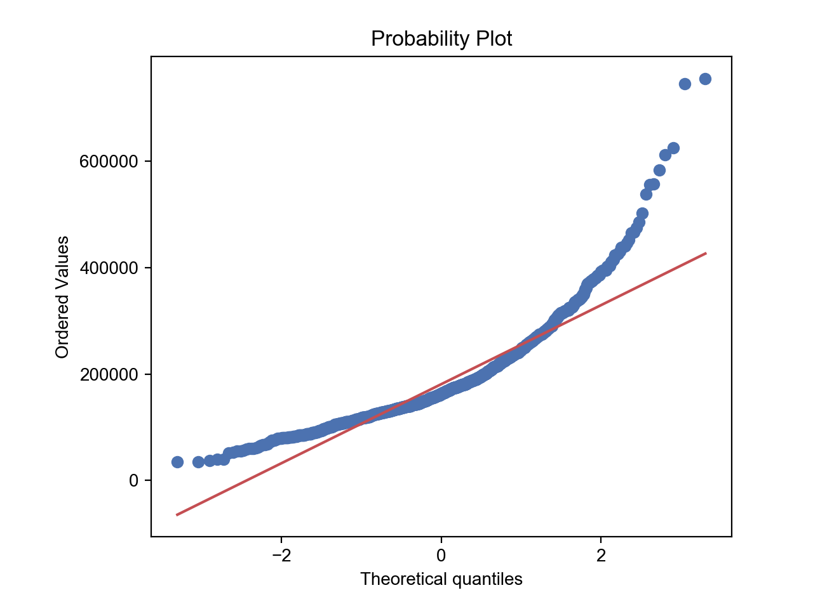
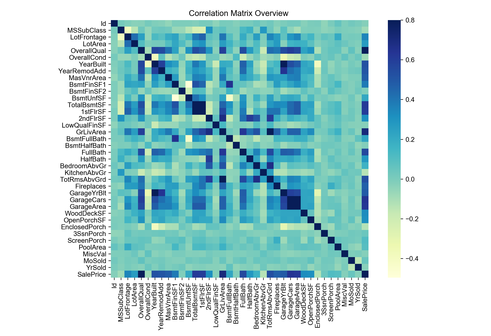
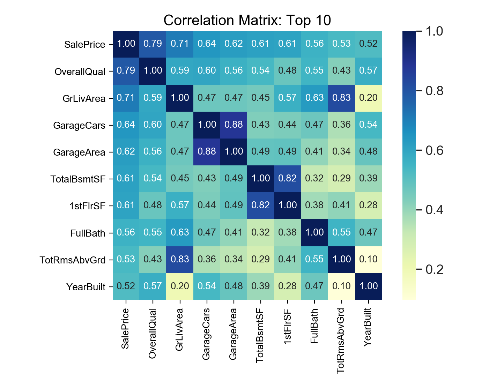
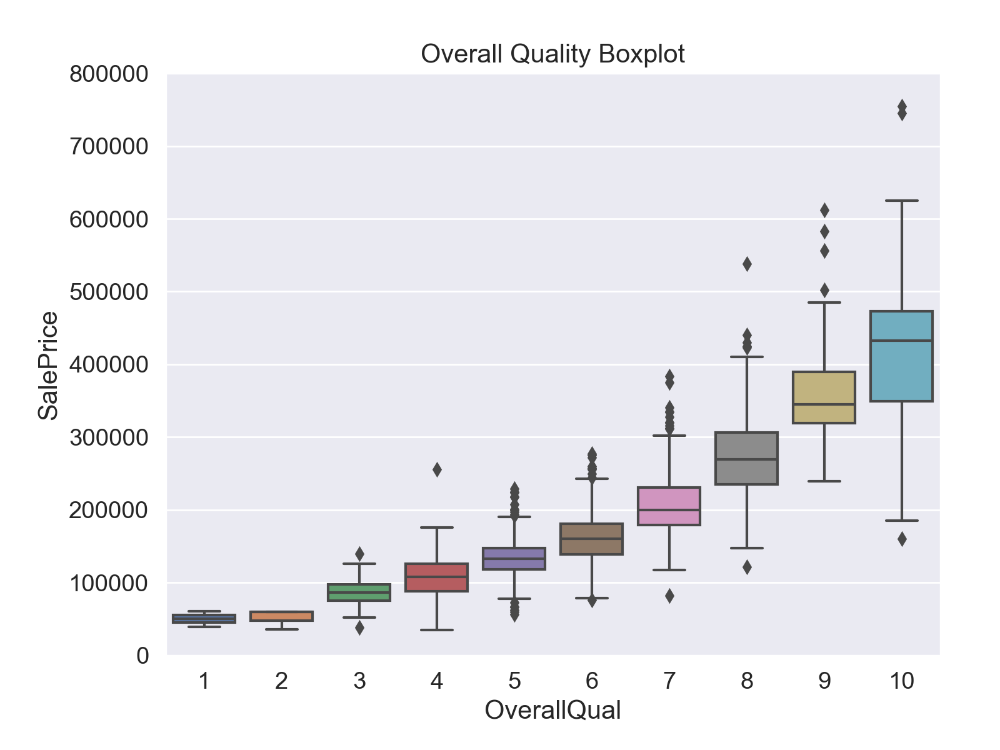
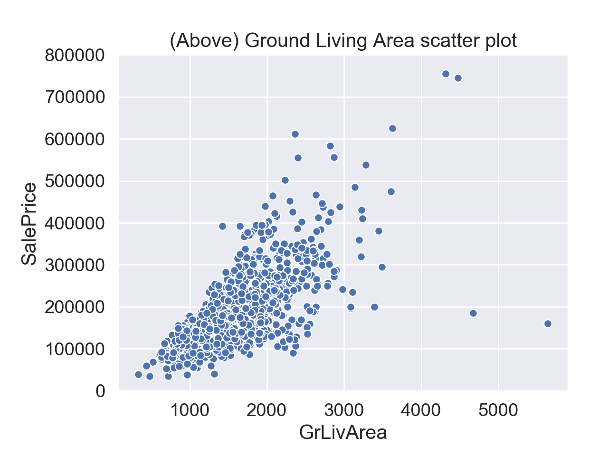

## House Prices Prediction

The work in this repository is based on a kaggle competition [House Prices: Advanced Regression Techniques](https://www.kaggle.com/c/house-prices-advanced-regression-techniques).
The aim of doing this project is to consolidate my knowledge of machine learning algorithms as well as
to experiment with the models that I have recently picked up, namely Light Gradient Boosting method
and Stacking method.

Prior to starting, I went through some very helpful notebooks and would highly recommend anyone who 
are about to work on this competition to have a look at them:

1. [Comprehensive data exploration with Python](https://www.kaggle.com/pmarcelino/comprehensive-data-exploration-with-python)
2. [House Prices: EDA to ML (Beginner)](https://www.kaggle.com/dejavu23/house-prices-eda-to-ml-beginner)
3. [Stacked Regressions](https://www.kaggle.com/serigne/stacked-regressions-top-4-on-leaderboard)

I started out doing exploratory data analysis to get a good overview of my data - both train and test. 
Some notable findings are: 

1. `SalePrice` in train data shows 
    * positive skewness (skewness: 1.882876)
    * longer-than-normal-distribution tail (kurtosis: 6.536282)
    * peak at around 110,000
    
    

2. The normal probability plot confirms that `SalePrice` doesn't follow a normal distribution. I will 
   have to do a log-transformation on `SalePrice` so that it approximates to a normal distribution. 

    

3. Some metric pairs have high correlations. To name a few:
    * `TotalBsmtSF` and `1stFlrSF`
    * `YearBuilt` and `GarageYrBlt`
    * `GarageCars` and `GarageAreas`
    
    It might worth considering removing one of the two in these pairs to remove multicollinearity. 
    However, it shouldn't be too much of a concern as multicollinearity only affect the coefficients
    but not the predictions or precision of the predictions.
    
    

4. Focusing on the top 10 highly correlated (to SalePrice) metrics, we have `OverallQual`, `GrLivArea` 
   and `GarageCars` clinching the top three spots. Since `GarageCars` and `GarageArea` are correlated
   (logically the garage area does determine the number of cars you can fit in the garage), I would 
   consider removing one of them. I also further explored the top two metrics: `OverallQual` and 
   `GrLivArea`.
    
   

5. The interquartile ranges for `SalePrice` increases with `OverallQual` in general.

   

6. There are two outliers in the `SalePrice` against `GrLivArea` scatterplot. While I could salvage these
   two data points by replacing with mean or median, I think it is ok to remove them for this case since
   they don't make up a large proportion of the data. However, should I have time to experiment in the 
   future, I would like to try including these two data points (rectified) in my models and compare the 
   results.
   
   

In [featureengineering.py](https://github.com/toomuchmath/house_prices/blob/master/scripts/feature_engineering.py), 
my plans were as follows:
1. Remove `Id` and delete outliers
2. Log transform `SalePrice` and set it aside for later use
3. Deal with missing values
4. Convert numerical columns (which are meant to be categorical) to categorical columns
5. Use box-cox transformation (in particular, I used [powertransformer](https://scikit-learn.org/stable/modules/generated/sklearn.preprocessing.PowerTransformer.html)
in sklearn) to ensure normality (and hence removing heteroscedasticity)
6. Get dummies

